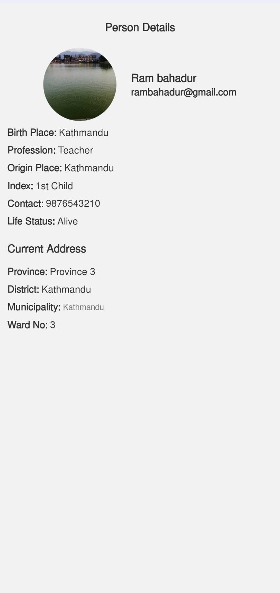
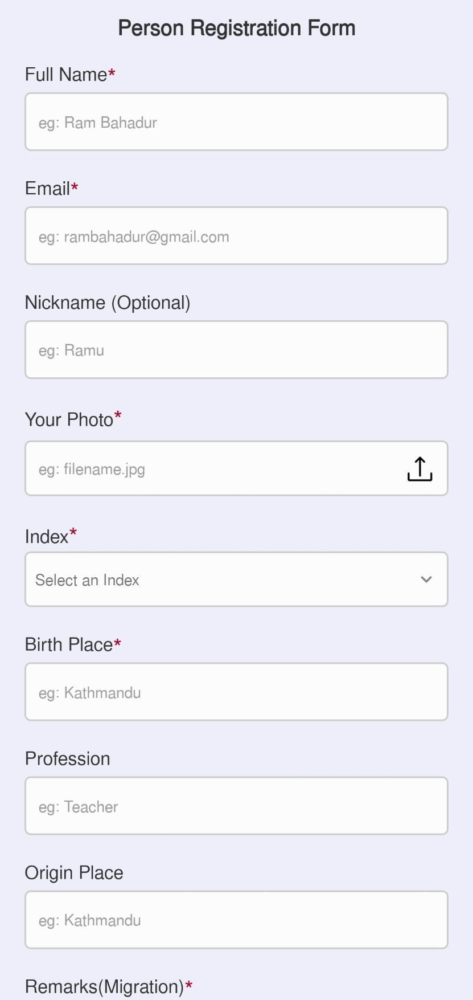

# MetaLogic

A simple form validation and the data rendering app.

Android

## Documentation

You can download the Android_apk here:

[@Android_apk](https://drive.google.com/file/d/1335U8ngOzP2VfnF728ujljoH_Y8NGJ0D/view?usp=sharing)

The app contains the registration form whose data is handled by state using zod and react-hook-form/resolver to validate it. The image data is handled by the react-native-image-picker, requests for gallery permission and then, goes for image selection.

## Screenshots

## Authors

- [@govin-10](https://www.github.com/octokatherine)
